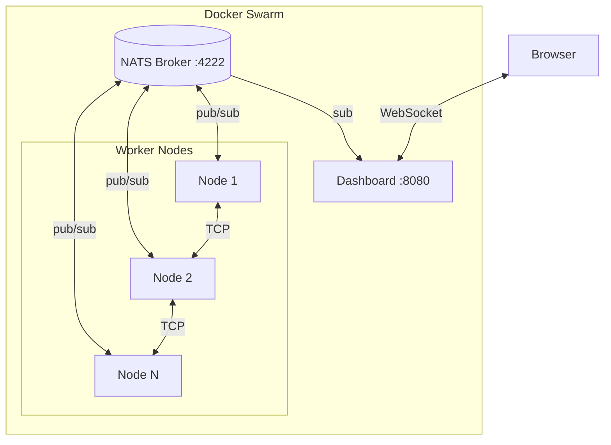
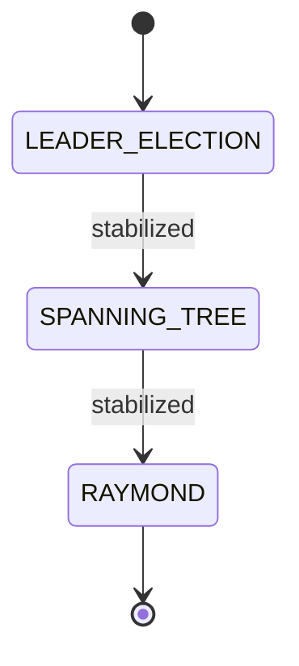
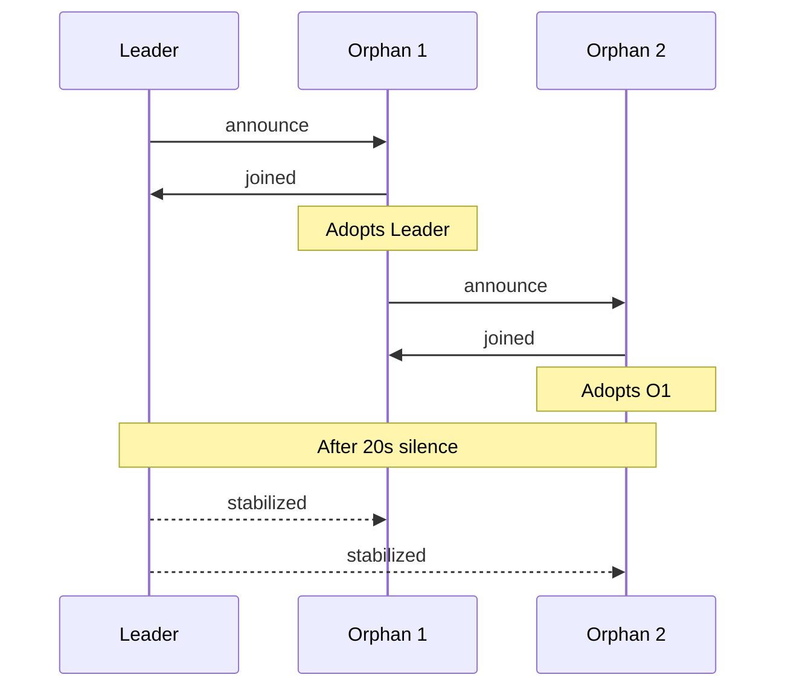

# Raymond Algorithm

Implementation of **Raymond's distributed mutual exclusion algorithm** with real-time visualization

<style>
h1 {
  background-color: #2B90B6;
  background-image: linear-gradient(45deg, #4EC5D4 10%, #146b8c 20%);
  background-size: 100%;
  -webkit-background-clip: text;
  -moz-background-clip: text;
  -webkit-text-fill-color: transparent;
  -moz-text-fill-color: transparent;
}
</style>

---

# The Mutual Exclusion Problem

In distributed systems, ensuring that **only one process** accesses a **shared resource** at a time.

<div class="grid grid-cols-2 gap-4 mt-6">
<div>

### Challenges

- No global clock
- Asynchronous communication
- Possible network failures
- No shared memory

</div>
<div>

### Requirements

- **Safety**: Only one node in CS
- **Liveness**: Requests eventually satisfied
- **Fairness**: FIFO order
- **Efficiency**: Few messages
- **Robustness**: Failures should be tolerated

</div>
</div>

<div class="mt-6 text-center">

> Raymond's algorithm (1989) solves this with **O(log N)** messages per access

</div>

---

# Technology Stack

<div class="grid grid-cols-3 gap-6 mt-6">

<div>

### Backend
- **Java 21**
- **Spring Boot 4.0.1**
- **Vaadin 25**
- **NATS** (Message Broker)
- **Jackson** (JSON)
- **Gradle 8.5+**

</div>

<div>

### Frontend
- **React 19**
- **TypeScript 5.9**
- **Vis.js Network**
- **Vite 7.3**

</div>

<div>

### DevOps
- **Docker**
- **Docker Swarm**
- **Alpine Linux**

</div>

</div>

---

# System Architecture

<div class="flex justify-center">



</div>

---

# Communication Channels

<div class="grid grid-cols-3 gap-4 mt-6">

<div class="p-4 bg-blue-500 bg-opacity-20 rounded-lg">

### NATS Broker
Pub/Sub for system events

- Leader Election
- Spanning Tree
- Dashboard updates

</div>

<div class="p-4 bg-green-500 bg-opacity-20 rounded-lg">

### TCP P2P Sockets
Direct node communication

- REQUEST
- PRIVILEGE

</div>

<div class="p-4 bg-purple-500 bg-opacity-20 rounded-lg">

### WebSocket
Vaadin Push

- Real-time updates
- Graph visualization

</div>

</div>

---
layout: center
---

# Node State Machine

<div class="flex justify-center">


</div>

<div class="mt-4 text-center text-gray-400">
Three sequential phases with stabilization-based transitions
</div>

---
transition: slide-up
level: 2
---

# Phase 1: Leader Election

**Algorithm**: Gossip-based with **"Min-ID wins"** strategy

<div class="grid grid-cols-2 gap-8 mt-4">

<div>

### How it works

1. Each node publishes its own ID
2. Compares received ID vs current leader
3. If received ID < current, update and propagate
4. Stabilization after **20s** of silence

**NATS Topic**: `leader-election`

</div>

<div>

```java {all|2|3-4|all}
// Node with smallest ID becomes leader
if (proposedLeaderId.compareTo(currentLeaderId) < 0) {
    nodeState.setLeaderId(proposedLeaderId);
    broker.publishId(nodeState.getLeaderId(),
                     "leader-election");
}
```

</div>

</div>

---
transition: slide-up
level: 2
---

# Phase 2: Spanning Tree

**Algorithm**: Incremental construction with **parent-child** adoption

<div class="grid grid-cols-2 gap-4">

<div>

### How it works

1. **Leader** broadcasts its identity on `announce`
2. **Orphans** listen and adopt the first announcer as parent
3. Once adopted, orphans start broadcasting too
4. Tree grows level by level, from leader to leaves
5. Each `joined` resets a 20-second timer
6. After 20s of silence → **stabilized**

**NATS Topics**: `announce`, `joined`, `stabilized`

</div>

<div>



</div>

</div>

---
level: 2
---

# Phase 3: Raymond Algorithm

<div class="grid grid-cols-2 gap-6 mt-4">

<div>

### How it works

1. Nodes are arranged in an **unrooted tree**
2. A unique **PRIVILEGE token** grants CS access
3. Each node has a **HOLDER** pointer toward the token
4. **REQUEST** messages travel along HOLDER path
5. **PRIVILEGE** returns along the request path
6. HOLDER pointers are updated as token moves

</div>

<div>

### Properties

- Each node knows only its **neighbors**
- Deadlock-free 
- Starvation-free

</div>

</div>

<div class="mt-6 text-center text-gray-400 text-sm">

The tree structure ensures REQUEST messages always reach the privileged node

</div>

---
level: 2
---

# Information held by each node

<div class="grid grid-cols-2 gap-6 mt-2">

<div>

### State Variables

| Variable | Description |
|----------|-------------|
| **HOLDER** | Pointer to privilege holder |
| **USING** | Node in critical section |
| **REQUEST_Q** | Pending requests queue |
| **ASKED** | Request sent flag |

</div>

<div>


<p class="text-xs text-gray-500 text-right">Source: Raymond, K. (1989)</p>

</div>

</div>

---

# Raymond: ASSIGN_PRIVILEGE

```java {all|3-4|7-9|12-15|18-21}
private synchronized void ASSIGN_PRIVILEGE(){
    // Preconditions
    if(!nodeState.isHolder() || nodeState.isUsing() || nodeState.isQueueEmpty())
        return;

    // Extract first from queue
    Dto.NodeId headRequest = nodeState.dequeueRequest();
    nodeState.setHolder(headRequest);
    nodeState.setAsked(false);

    // If I'm the new holder -> enter CS
    if(nodeState.isHolder()){
        nodeState.setUsing(true);
        nodeState.setStatus(Dto.NodeStatus.CRITICAL);
        return;
    }

    // Otherwise send PRIVILEGE to new holder
    Dto.RaymondEvent event = Dto.RaymondEvent.builder()
            .eventType(Dto.RaymondEventType.PRIVILEGE).build();
    socketManager.send(event, nodeState.getHolderAddress());
}
```

---

# Raymond: MAKE_REQUEST

```java {all|3-4|7-10|12-13|15-16}
private synchronized void MAKE_REQUEST(){
    // Preconditions
    if(nodeState.isHolder() || nodeState.isQueueEmpty() || nodeState.hasAlreadyAsked())
        return;

    // Build REQUEST event
    Dto.RaymondEvent raymondEvent = Dto.RaymondEvent.builder()
            .nodeId(nodeState.getId())
            .eventType(Dto.RaymondEventType.REQUEST)
            .build();

    // Get holder address and send
    Dto.SocketAddress holderAddress = nodeState.getHolderAddress().orElseThrow();
    socketManager.send(raymondEvent, holderAddress);

    // Mark as already asked
    this.nodeState.setAsked(true);
}
```

---

# Raymond: Main Loop

```java {all|2-5|7-8|10-14|16-19}
private void loop() {
    while (running) {
        // 1. Work outside critical section (20-40 seconds)
        long waitTime = 20000 + random.nextInt(20000);
        Thread.sleep(waitTime);

        // 2. Request critical section
        askForCriticalSection();

        // 3. Wait until granted
        synchronized (nodeState) {
            while (nodeState.getStatus() != Dto.NodeStatus.CRITICAL)
                nodeState.wait();
        }

        // 4. Execute critical section (2-4 seconds)
        Thread.sleep(2000 + random.nextInt(2000));

        // 5. Exit critical section
        exitFromCriticalSection();
    }
}
```

---

# Raymond: Four Events

There are **four events** which can alter the assignment of privilege and/or necessitate the sending of a REQUEST message

<div class="grid grid-cols-2 gap-4 mt-4 text-sm">

<div class="p-3 bg-blue-500 bg-opacity-10 rounded">

**1. Node wishes to enter CS**
```
enqueue(REQUEST_Q, self)
ASSIGN_PRIVILEGE()
MAKE_REQUEST()
```

</div>

<div class="p-3 bg-green-500 bg-opacity-10 rounded">

**2. Node receives REQUEST from X**
```
enqueue(REQUEST_Q, X)
ASSIGN_PRIVILEGE()
MAKE_REQUEST()
```

</div>

<div class="p-3 bg-purple-500 bg-opacity-10 rounded">

**3. Node receives PRIVILEGE**
```
HOLDER := self
ASSIGN_PRIVILEGE()
MAKE_REQUEST()
```

</div>

<div class="p-3 bg-orange-500 bg-opacity-10 rounded">

**4. Node exits CS**
```
USING := false
ASSIGN_PRIVILEGE()
MAKE_REQUEST()
```

</div>

</div>

---

# 1. Node wishes to enter CS

Called when a node wants to enter the critical section

```java {all|3-4|6-7|9-10}
private synchronized void askForCriticalSection(){
    // Event: The node wishes to enter the critical section
    this.nodeState.enqueueRequest(nodeState.getId());
    this.nodeState.setStatus(Dto.NodeStatus.REQUESTING);

    // Try to assign privilege (if we hold it)
    ASSIGN_PRIVILEGE();

    // Request privilege from holder (if needed)
    MAKE_REQUEST();
}
```

<div class="mt-4 text-gray-400 text-sm">

1. Adds itself to the request queue
2. Sets status to REQUESTING
3. Calls both procedures to handle the request

</div>

---

# 4. Node exits CS

Called when a node exits the critical section

```java {all|3-4|6-7|9-10}
private synchronized void exitFromCriticalSection(){
    // Event: The node exits the critical section
    this.nodeState.setUsing(false);
    this.nodeState.setStatus(Dto.NodeStatus.IDLE);

    // Pass privilege to next in queue (if any)
    ASSIGN_PRIVILEGE();

    // Forward any pending requests
    MAKE_REQUEST();
}
```

<div class="mt-4 text-gray-400 text-sm">

1. Releases the critical section (USING = false)
2. Sets status back to IDLE
3. Passes privilege to the next waiting node

</div>

---

# 2. Node receives REQUEST

Called when a node receives a REQUEST message from another node

```java {all|3|5-6|8-9}
private synchronized void onRequestEvent(RaymondEvent event){
    // Event: The node receives a REQUEST message
    nodeState.enqueueRequest(event.nodeId());

    // Try to assign privilege (if we hold it)
    ASSIGN_PRIVILEGE();

    // Forward request toward holder (if needed)
    MAKE_REQUEST();
}
```

<div class="mt-4 text-gray-400 text-sm">

1. Enqueues the requesting node's ID
2. If holding privilege and not using, passes it along
3. If not holding privilege, forwards request toward holder

</div>

---

# 3. Node receives PRIVILEGE

Called when a node receives the PRIVILEGE token

```java {all|3|5-6|8-9}
private synchronized void onPrivilegeEvent(){
    // Event: The node receives the PRIVILEGE
    nodeState.setHolder(nodeState.getId());

    // Try to assign privilege (to self or next in queue)
    ASSIGN_PRIVILEGE();

    // Forward any pending requests
    MAKE_REQUEST();
}
```

<div class="mt-4 text-gray-400 text-sm">

1. Becomes the new holder (points to self)
2. Assigns privilege: enters CS if self is first in queue, otherwise passes privilege
3. Forwards pending requests if not holding privilege anymore

</div>

---

# Real-Time Dashboard: Network Graph

<div class="flex justify-center">
  
</div>

<div class="mt-2 text-center text-sm text-gray-400">
Node colors: <span class="text-blue-400">IDLE</span> | <span class="text-yellow-400">REQUESTING</span> | <span class="text-red-400">CRITICAL (PRIVILEGE)</span>
</div>

---

# Real-Time Dashboard: Event Log

<div class="flex justify-center">
  
</div>

<div class="mt-2 text-center text-sm text-gray-400">
Filterable log panel showing REQUEST, PRIVILEGE, and CRITICAL SECTION events
</div>

---

# Deployment: compose.yaml

<div class="grid grid-cols-2 gap-4">

<div>

```yaml
  broker:
    image: nats:alpine
    command: "-js -m 8222"
    ports:
      - "8222:8222"
    networks:
      - swarm-net
    deploy:
      replicas: 1

  # Web Dashboard
  dashboard:
    image: dashboard:latest
    build:
      context: ./dashboard
    ports:
      - "8091:8080"
    environment:
      - BROKER_URL=nats://broker:4222
    networks:
      - swarm-net
    deploy:
      replicas: 1
```

</div>

<div>

```yaml
  # Worker Nodes
  node:
    image: node-worker:latest
    build:
      context: ./node
    environment:
      - BROKER_URL=nats://broker:4222
    networks:
      - swarm-net
    deploy:
      replicas: 10

networks:
  swarm-net:
    driver: overlay
```

<div class="mt-4 text-sm">

### Quick Start
```bash
docker swarm init && ./swarm-launch.sh
```

**Access:** `http://localhost:8091`

</div>

</div>

</div>

---
layout: center
class: text-center
---

# Demo

<div class="text-6xl mt-8 mb-8">

```bash
./swarm-launch.sh
```

</div>

Starting the cluster with 10 nodes and real-time visualization

---
layout: center
class: text-center
---

# References

<div class="mt-8 text-left max-w-2xl mx-auto">

- **Raymond, K. (1989)**. *"A Tree-Based Algorithm for Distributed Mutual Exclusion"*

</div>

---
layout: center
class: text-center
---

# Thank you!

<div class="mt-8">

Repository: [github.com/nyrfinyr/raymond-distributed-ai](https://github.com/nyrfinyr/raymond-distributed-ai)

</div>
